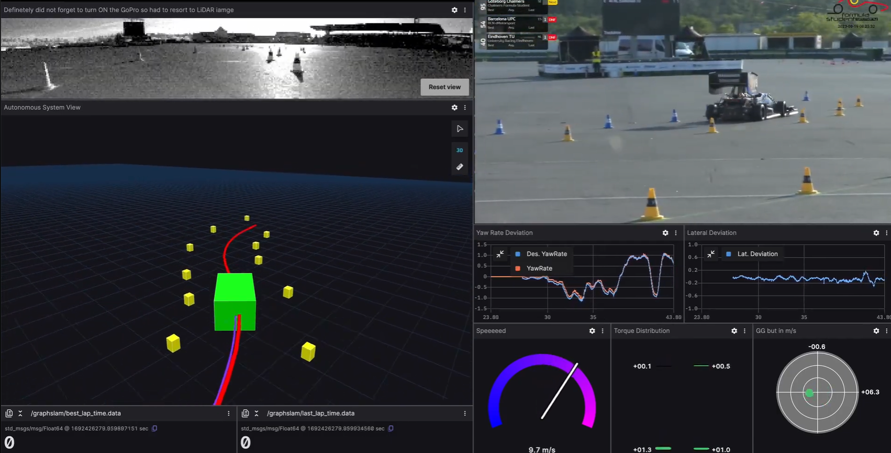

# Feature-Based EKF SLAM for Autonomous Racing



## Project Overview
This repository contains a **MATLAB implementation of an Extended Kalman Filter (EKF) for Simultaneous Localization and Mapping (SLAM)**. The project simulates a differential drive robot navigating through track boundaries defined by discrete landmarks (traffic cones), inspired by **Formula Student Driverless** competitions.

| Track 1: Circular | Track 2: Stadium | Track 3: Square w/ Corners |
|:---:|:---:|:---:|
|  |  |  |
| *Ground Truth Map* | *Ground Truth Map* | *Ground Truth Map* |


The system addresses the "Chicken and Egg" problem of SLAM by simultaneously estimating the robot's pose $(x, y, \theta)$ and the Cartesian coordinates of the landmarks using a range-bearing sensor model.

## Repository Structure
The project is organized into modular MATLAB scripts and a resources folder:

```plaintext
├── Cone_EKF.mlx                  # MAIN SCRIPT: Entry point for simulation & visualization
├── diffDriveModel.m              # HELPER: Differential drive kinematic motion model
├── run_ekf_simulation.m          # CORE LOGIC: The EKF prediction-correction loop
├── calculate_simulation_error.m  # VALIDATION: RMSE calculation against Ground Truth
├── gen_corner.m                  # UTILITY: Geometry generator for track corners
├── Images/                       # Simulation results (Images & Videos)
│   ├── Round Track EKF.png
│   ├── Round Track.mp4
│   ├── Extended Round Track.png
│   ├── Extended Round Track.mp4
│   ├── Square Rounded Corner Track.png
│   └── Square Rounded Corner Track.mp4
└── README.md
```

## 📍 EKF SLAM Implementation

This module implements the **Extended Kalman Filter (EKF)** algorithm to solve the Simultaneous Localization and Mapping (SLAM) problem. The robot estimates its own pose $(x, y, \theta)$ and the positions of landmarks in the environment while navigating through uncertain motion and noisy sensor data.

### 🚀 Key Features
* **Feature-Based Mapping:** Uses extracted landmarks (range-bearing observations) to build the map.
* **Non-Linear State Estimation:** Utilizes the Jacobian matrix to linearize the motion and observation models.
* **Covariance Updates:** Dynamically updates the uncertainty ellipses for both the robot pose and landmark locations.

### 🧠 Algorithm Overview
The EKF SLAM process operates in a recursive **Prediction-Correction** loop:

1. **Prediction Step (Motion Model):** The robot predicts its current state $\hat{x}_t$ based on the previous state and control inputs (odometry). The covariance matrix $P_t$ is updated to account for motion noise.
   
   $\displaystyle \bar{\mu}_t = g(\mu_{t-1}, u_t)$
   
   $\displaystyle \bar{\Sigma}_t = G_t \Sigma_{t-1} G_t^T + R_t$

2. **Correction Step (Observation Model):** The robot observes landmarks using sensors (Lidar/Camera). The difference between the *expected* observation and the *actual* measurement (the innovation) is used to correct the state via the Kalman Gain ($K_t$).
   
   $\displaystyle K_t = \bar{\Sigma}_t H_t^T (H_t \bar{\Sigma}_t H_t^T + Q_t)^{-1}$
   
   $\displaystyle \mu_t = \bar{\mu}_t + K_t (z_t - h(\bar{\mu}_t))$

### 📊 Results & Visualization
The image below shows the resulting map compared to the ground truth. The blue ellipses represent the covariance (uncertainty) of each landmark estimation, which shrinks as the robot re-observes the features.

| Estimated Trajectory | Landmark Uncertainty | Error Analysis |
|:---:|:---:|:---:|
|  |  |  |
| *Robot path (Red) vs Ground Truth (Green)* | *3-Sigma Uncertainty Ellipses* | *RMSE of X, Y, and Theta over time* |
